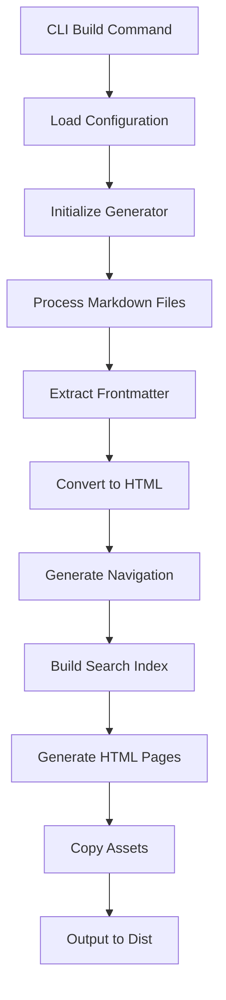
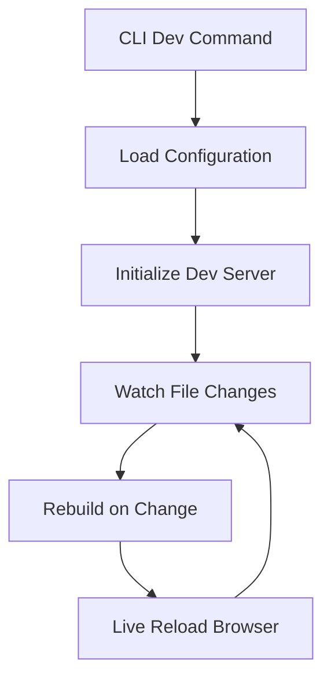

# Knowledge System Architecture

## Overview

Knowledge is a static documentation generator built with a modular and extensible architecture. This document details the internal structure, design patterns, and architectural decisions.

## Architectural Principles

### 1. **Separation of Concerns**
- **CLI**: Command line interface
- **Generator**: Documentation generation logic
- **Search**: Full-text search system
- **Markdown**: Content processing
- **Config**: Configuration management
- **Dev Server**: Development server

### 2. **Modularity**
- Each module has a specific responsibility
- Well-defined interfaces between modules
- Facilitates testing and maintenance

### 3. **Extensibility**
- Pluggable theme system
- Flexible configuration
- Hooks for customization

### 4. **Performance**
- Build-time optimization
- Lazy loading of resources
- Optimized search index

## Module Structure

### Core Modules

```typescript
// src/cli.ts - Command line interface
export class CLI {
    build(options: BuildOptions): Promise<void>
    dev(options: DevOptions): Promise<void>
    serve(options: ServeOptions): Promise<void>
    init(options: InitOptions): Promise<void>
}

// src/generator.ts - Main generator
export class DocumentationGenerator {
    generate(): Promise<void>
    processMarkdownFiles(): Promise<void>
    generateNavigation(): void
    generatePages(): Promise<void>
    copyAssets(): Promise<void>
}

// src/search.ts - Search system
export class SearchIndexGenerator {
    addPage(page: DocumentPage): void
    buildIndex(): lunr.Index
    getSerializableData(): SearchData
}

// src/markdown.ts - Markdown processor
export class MarkdownProcessor {
    process(content: string): Promise<string>
    extractFrontmatter(content: string): FrontmatterResult
    highlightCode(html: string): string
}

// src/config.ts - Configurations
export interface KnowledgeConfig {
    inputDir: string
    outputDir: string
    site: SiteConfig
    features: FeatureConfig
    // ...
}
```

## Processing Flow

### 1. Build Process



### 2. Development Process



## Detailed File Structure

```
knowledge/
├── src/                           # Main source code
│   ├── cli.ts                    # CLI interface with Commander.js
│   ├── generator.ts              # Documentation generator
│   ├── search.ts                 # Search system with Lunr.js
│   ├── markdown.ts               # Markdown processor with Marked
│   ├── config.ts                 # Types and configurations
│   └── dev-server.ts             # Development server
├── themes/                       # Theme system
│   └── default/                  # Default theme
│       ├── layouts/              # HTML templates
│       │   └── default.html      # Main layout
│       └── assets/               # Theme assets
│           ├── css/              # Stylesheets
│           │   ├── style.css     # Main styles
│           │   ├── search.css    # Search styles
│           │   ├── highlight.css # Syntax highlighting
│           │   └── page-highlighter.css
│           └── js/               # JavaScript scripts
│               ├── main.js       # Main script
│               ├── search.js     # Search functionality
│               └── page-highlighter.js
├── docs/                         # Source documentation
├── dist/                         # Generated output
└── knowledge.config.ts            # Project configuration
```

## Main Components

### 1. CLI (Command Line Interface)

**Responsibilities:**
- Command line argument parsing
- Command orchestration (build, dev, serve, init)
- Configuration loading
- Error handling

**Technologies:**
- Commander.js for argument parsing
- Bun.js for execution

### 2. Generator (Documentation Generator)

**Responsibilities:**
- Markdown file discovery
- Frontmatter processing
- Markdown → HTML conversion
- Automatic navigation generation
- Template application
- Asset copying

**Processing Flow:**
1. Scan input directory
2. Read and parse .md files
3. Extract metadata (frontmatter)
4. Convert to HTML
5. Apply templates
6. Generate output files

### 3. Search (Search System)

**Responsibilities:**
- Content indexing during build
- Serialized JSON index generation
- Relevance weight configuration

**Features:**
- **Engine**: Lunr.js 2.3.9
- **Indexed fields**: title (weight 10), excerpt (weight 5), content (weight 1)
- **Output format**: JSON with documents and index data
- **Performance**: Optimized index for offline search

### 4. Markdown Processor

**Responsibilities:**
- Markdown parsing with extensions
- Code syntax highlighting
- YAML frontmatter processing
- Automatic excerpt generation

**Technologies:**
- Marked.js for Markdown parsing
- Highlight.js for syntax highlighting
- Regex for frontmatter extraction

### 5. Theme System

**Responsibilities:**
- Modular HTML templates
- Organized CSS/JS assets
- Flexible layout system

**Theme Structure:**
```
theme/
├── layouts/
│   ├── default.html      # Main layout
│   ├── page.html         # Page layout
│   └── index.html        # Index layout
└── assets/
    ├── css/
    ├── js/
    └── images/
```

## System Configuration

### Configuration Hierarchy

1. **Default configuration** (src/config.ts)
2. **Project configuration** (knowledge.config.ts)
3. **CLI arguments** (override configurations)

### Configuration Types

```typescript
interface KnowledgeConfig {
    // Directories
    inputDir: string
    outputDir: string
    templatesDir: string
    themesDir: string

    // Site
    site: {
        title: string
        description: string
        baseUrl: string
        author: string
    }

    // Theme
    theme: string
    layout: string

    // Navigation
    navigation: {
        auto: boolean
        items?: NavigationItem[]
    }

    // Features
    features: {
        search: boolean
        syntaxHighlight: boolean
        darkMode: boolean
        tableOfContents: boolean
        breadcrumbs: boolean
        editOnGithub?: string
    }

    // Markdown
    markdown: {
        breaks: boolean
        linkify: boolean
        typographer: boolean
    }

    // Development
    dev: {
        port: number
        host: string
        livereload: boolean
    }
}
```

## Performance and Optimizations

### Build Time Optimizations

1. **Parallel Processing**: Process files in parallel when possible
2. **Asset Caching**: Assets copied only when needed
3. **Optimized Index**: Efficient index generation

### Runtime Optimizations

1. **Lazy Loading**: Resources loaded on demand
2. **Minification**: CSS and JS minified in production
3. **Compression**: Assets served with compression
4. **Cache Headers**: Appropriate cache headers

### Search Optimizations

1. **Pre-built Index**: Generated during build
2. **Efficient Serialization**: Optimized JSON format
3. **Incremental Search**: Real-time results
4. **Intelligent Relevance**: Weight-based scoring system

## Security

### Input Sanitization

- Markdown content sanitization
- HTML escaping in templates
- File path validation

### Output Security

- Appropriate security headers
- Preventing XSS
- URL sanitization

## Testability

### Testable Architecture

- Independent modules
- Well-defined interfaces
- Dependency injection
- I/O mocks

### Testing Strategy

1. **Unit Tests**: Individual module tests
2. **Integration Tests**: Full flow tests
3. **E2E Tests**: User interface tests

## Extensibility

### Plugin System (Future)

```typescript
interface Plugin {
    name: string
    version: string
    hooks: {
        beforeBuild?: () => void
        afterBuild?: () => void
        processMarkdown?: (content: string) => string
        generatePage?: (page: DocumentPage) => DocumentPage
    }
}
```

### Custom Themes

- Theme inheritance system
- Specific template overrides
- Custom assets
- Theme-based configuration

### Custom Processors

- Customized Markdown processors
- Content generators
- Data transformers

## Build Metrics

- Build time
- Number of processed pages
- Index size
- Generated assets size

## Runtime Metrics

- Page load time
- Search performance
- Memory usage
- Accessibility metrics

## Development Lifecycle

### Development Lifecycle

1. **Watch**: File change monitoring
2. **Rebuild**: Incremental reconstruction
3. **Reload**: Automatic browser update

### Production Lifecycle

1. **Build**: Complete documentation generation
2. **Optimize**: Asset optimization
3. **Deploy**: Static site publication

## Architectural Decisions

### Why Bun.js?

- **Performance**: Faster runtime than Node.js
- **Native TypeScript**: Built-in support
- **Bundler integrated**: No need for webpack/rollup
- **Package manager**: Fast dependency management

### Why Lunr.js?

- **Offline**: Search works without server
- **Performance**: Optimized index for fast search
- **Flexibility**: Relevance configuration
- **Size**: Small bundle

### Why Marked.js?

- **Compatibility**: Full CommonMark support
- **Extensibility**: Plugin system
- **Performance**: Fast parsing
- **Maturity**: Stable and tested library

## Architectural Troubleshooting

### Common Problems

1. **Slow build**: Check parallel processing
2. **Search not working**: Check index generation
3. **Assets not loading**: Check relative paths
4. **Memory leaks**: Check watcher cleanup

### Debug Tools

- Detailed logs in verbose mode
- Performance profiling
- Bundle size analysis
- Build time metrics

---

This architecture was designed to be **simple**, **extensible**, and **performant**, following modern development best practices. 