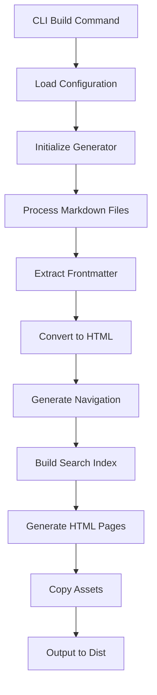
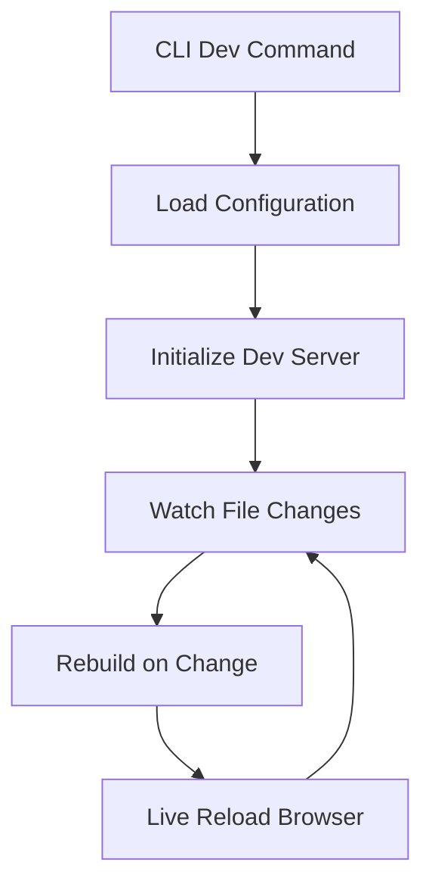

# 🏗️ Arquitetura do Sistema Knowledge

## 📋 Visão Geral

O Knowledge é um gerador de documentação estática construído com uma arquitetura modular e extensível. Este documento detalha a estrutura interna, padrões de design e decisões arquiteturais.

## 🎯 Princípios Arquiteturais

### 1. **Separação de Responsabilidades**
- **CLI**: Interface de linha de comando
- **Generator**: Lógica de geração de documentação
- **Search**: Sistema de busca full-text
- **Markdown**: Processamento de conteúdo
- **Config**: Gerenciamento de configurações
- **Dev Server**: Servidor de desenvolvimento

### 2. **Modularidade**
- Cada módulo tem uma responsabilidade específica
- Interfaces bem definidas entre módulos
- Facilita testes e manutenção

### 3. **Extensibilidade**
- Sistema de temas plugável
- Configuração flexível
- Hooks para customização

### 4. **Performance**
- Build-time optimization
- Lazy loading de recursos
- Índice de busca otimizado

## 🏛️ Estrutura de Módulos

### Core Modules

```typescript
// src/cli.ts - Interface de linha de comando
export class CLI {
    build(options: BuildOptions): Promise<void>
    dev(options: DevOptions): Promise<void>
    serve(options: ServeOptions): Promise<void>
    init(options: InitOptions): Promise<void>
}

// src/generator.ts - Gerador principal
export class DocumentationGenerator {
    generate(): Promise<void>
    processMarkdownFiles(): Promise<void>
    generateNavigation(): void
    generatePages(): Promise<void>
    copyAssets(): Promise<void>
}

// src/search.ts - Sistema de busca
export class SearchIndexGenerator {
    addPage(page: DocumentPage): void
    buildIndex(): lunr.Index
    getSerializableData(): SearchData
}

// src/markdown.ts - Processador de Markdown
export class MarkdownProcessor {
    process(content: string): Promise<string>
    extractFrontmatter(content: string): FrontmatterResult
    highlightCode(html: string): string
}

// src/config.ts - Configurações
export interface DocForgeConfig {
    inputDir: string
    outputDir: string
    site: SiteConfig
    features: FeatureConfig
    // ...
}
```

## 🔄 Fluxo de Processamento

### 1. Build Process



### 2. Development Process



## 📁 Estrutura de Arquivos Detalhada

```
knowledge/
├── src/                           # Código fonte principal
│   ├── cli.ts                    # Interface CLI com Commander.js
│   ├── generator.ts              # Gerador de documentação
│   ├── search.ts                 # Sistema de busca com Lunr.js
│   ├── markdown.ts               # Processador Markdown com Marked
│   ├── config.ts                 # Tipos e configurações
│   └── dev-server.ts             # Servidor de desenvolvimento
├── themes/                       # Sistema de temas
│   └── default/                  # Tema padrão
│       ├── layouts/              # Templates HTML
│       │   └── default.html      # Layout principal
│       └── assets/               # Assets do tema
│           ├── css/              # Folhas de estilo
│           │   ├── style.css     # Estilos principais
│           │   ├── search.css    # Estilos da busca
│           │   ├── highlight.css # Syntax highlighting
│           │   └── page-highlighter.css
│           └── js/               # Scripts JavaScript
│               ├── main.js       # Script principal
│               ├── search.js     # Funcionalidade de busca
│               └── page-highlighter.js
├── docs/                         # Documentação fonte
├── dist/                         # Saída gerada
└── docforge.config.ts            # Configuração do projeto
```

## 🔧 Componentes Principais

### 1. CLI (Command Line Interface)

**Responsabilidades:**
- Parsing de argumentos de linha de comando
- Orquestração de comandos (build, dev, serve, init)
- Carregamento de configurações
- Tratamento de erros

**Tecnologias:**
- Commander.js para parsing de argumentos
- Bun.js para execução

### 2. Generator (Gerador de Documentação)

**Responsabilidades:**
- Descoberta de arquivos Markdown
- Processamento de frontmatter
- Conversão Markdown → HTML
- Geração de navegação automática
- Aplicação de templates
- Cópia de assets

**Fluxo de Processamento:**
1. Scan do diretório de entrada
2. Leitura e parsing de arquivos .md
3. Extração de metadados (frontmatter)
4. Conversão para HTML
5. Aplicação de templates
6. Geração de arquivos de saída

### 3. Search (Sistema de Busca)

**Responsabilidades:**
- Indexação de conteúdo durante o build
- Geração de índice JSON serializado
- Configuração de pesos de relevância

**Características:**
- **Engine**: Lunr.js 2.3.9
- **Campos indexados**: title (peso 10), excerpt (peso 5), content (peso 1)
- **Formato de saída**: JSON com documentos e dados do índice
- **Performance**: Índice otimizado para busca offline

### 4. Markdown Processor

**Responsabilidades:**
- Parsing de Markdown com extensões
- Syntax highlighting de código
- Processamento de frontmatter YAML
- Geração de excerpts automáticos

**Tecnologias:**
- Marked.js para parsing Markdown
- Highlight.js para syntax highlighting
- Regex para extração de frontmatter

### 5. Theme System

**Responsabilidades:**
- Templates HTML modulares
- Assets CSS/JS organizados
- Sistema de layouts flexível

**Estrutura de Tema:**
```
theme/
├── layouts/
│   ├── default.html      # Layout principal
│   ├── page.html         # Layout de página
│   └── index.html        # Layout de índice
└── assets/
    ├── css/
    ├── js/
    └── images/
```

## 🔌 Sistema de Configuração

### Hierarquia de Configuração

1. **Configuração padrão** (src/config.ts)
2. **Arquivo de configuração** (docforge.config.ts)
3. **Argumentos CLI** (sobrescreve configurações)

### Tipos de Configuração

```typescript
interface DocForgeConfig {
    // Diretórios
    inputDir: string
    outputDir: string
    templatesDir: string
    themesDir: string

    // Site
    site: {
        title: string
        description: string
        baseUrl: string
        author: string
    }

    // Tema
    theme: string
    layout: string

    // Navegação
    navigation: {
        auto: boolean
        items?: NavigationItem[]
    }

    // Funcionalidades
    features: {
        search: boolean
        syntaxHighlight: boolean
        darkMode: boolean
        tableOfContents: boolean
        breadcrumbs: boolean
        editOnGithub?: string
    }

    // Markdown
    markdown: {
        breaks: boolean
        linkify: boolean
        typographer: boolean
    }

    // Desenvolvimento
    dev: {
        port: number
        host: string
        livereload: boolean
    }
}
```

## 🚀 Performance e Otimizações

### Build Time Optimizations

1. **Processamento Paralelo**: Arquivos processados em paralelo quando possível
2. **Cache de Assets**: Assets copiados apenas quando necessário
3. **Índice Otimizado**: Geração eficiente do índice de busca

### Runtime Optimizations

1. **Lazy Loading**: Recursos carregados sob demanda
2. **Minificação**: CSS e JS minificados em produção
3. **Compressão**: Assets servidos com compressão
4. **Cache Headers**: Headers de cache apropriados

### Search Optimizations

1. **Índice Pré-construído**: Gerado durante o build
2. **Serialização Eficiente**: Formato JSON otimizado
3. **Busca Incremental**: Resultados em tempo real
4. **Relevância Inteligente**: Sistema de pontuação por peso

## 🔒 Segurança

### Input Sanitization

- Sanitização de conteúdo Markdown
- Escape de HTML em templates
- Validação de caminhos de arquivo

### Output Security

- Headers de segurança apropriados
- Prevenção de XSS
- Sanitização de URLs

## 🧪 Testabilidade

### Arquitetura Testável

- Módulos independentes
- Interfaces bem definidas
- Injeção de dependências
- Mocks para I/O

### Estratégia de Testes

1. **Unit Tests**: Testes de módulos individuais
2. **Integration Tests**: Testes de fluxo completo
3. **E2E Tests**: Testes de interface de usuário

## 🔮 Extensibilidade

### Plugin System (Futuro)

```typescript
interface Plugin {
    name: string
    version: string
    hooks: {
        beforeBuild?: () => void
        afterBuild?: () => void
        processMarkdown?: (content: string) => string
        generatePage?: (page: DocumentPage) => DocumentPage
    }
}
```

### Custom Themes

- Sistema de herança de temas
- Override de templates específicos
- Assets customizados
- Configuração por tema

### Custom Processors

- Processadores de Markdown customizados
- Geradores de conteúdo
- Transformadores de dados

## 📊 Métricas e Monitoramento

### Build Metrics

- Tempo de build
- Número de páginas processadas
- Tamanho do índice de busca
- Tamanho dos assets gerados

### Runtime Metrics

- Tempo de carregamento de páginas
- Performance de busca
- Uso de memória
- Métricas de acessibilidade

## 🔄 Ciclo de Vida

### Development Lifecycle

1. **Watch**: Monitoramento de mudanças em arquivos
2. **Rebuild**: Reconstrução incremental
3. **Reload**: Atualização automática do browser

### Production Lifecycle

1. **Build**: Geração completa da documentação
2. **Optimize**: Otimização de assets
3. **Deploy**: Publicação do site estático

## 🎯 Decisões Arquiteturais

### Por que Bun.js?

- **Performance**: Runtime mais rápido que Node.js
- **TypeScript nativo**: Suporte built-in
- **Bundler integrado**: Sem necessidade de webpack/rollup
- **Package manager**: Gerenciamento de dependências rápido

### Por que Lunr.js?

- **Offline**: Busca funciona sem servidor
- **Performance**: Índice otimizado para busca rápida
- **Flexibilidade**: Configuração de relevância
- **Tamanho**: Bundle pequeno

### Por que Marked.js?

- **Compatibilidade**: Suporte completo ao CommonMark
- **Extensibilidade**: Sistema de plugins
- **Performance**: Parsing rápido
- **Maturidade**: Biblioteca estável e testada

## 🔧 Troubleshooting Arquitetural

### Problemas Comuns

1. **Build lento**: Verificar processamento paralelo
2. **Busca não funciona**: Verificar geração do índice
3. **Assets não carregam**: Verificar caminhos relativos
4. **Memory leaks**: Verificar cleanup de watchers

### Debug Tools

- Logs detalhados em modo verbose
- Profiling de performance
- Análise de bundle size
- Métricas de build time

---

Esta arquitetura foi projetada para ser **simples**, **extensível** e **performática**, seguindo as melhores práticas de desenvolvimento moderno. 