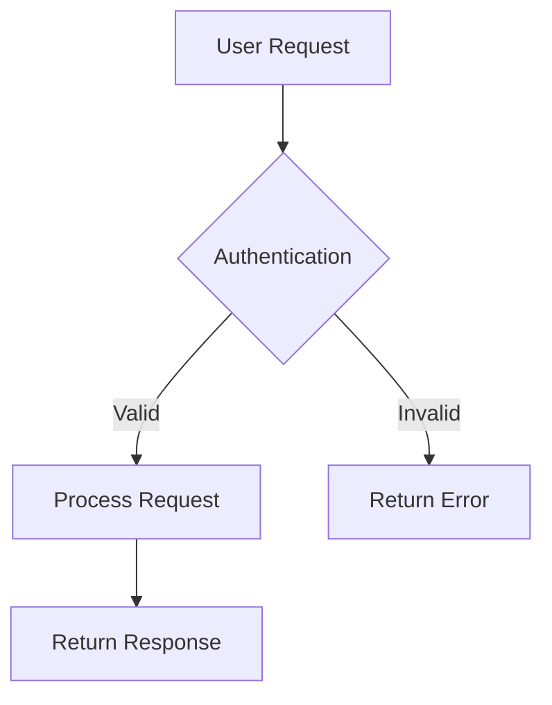

# 💡 Tips for Efficient Documentation

## 🎯 Core Principles

### **1. Start Simple**
- `index.md` - What the project is and why it exists
- `installation.md` - How to get started (prerequisites, setup)
- `quick-start.md` - First successful use in 5 minutes
- `api.md` - Core functionality reference

### **2. Organize by Audience**
```
docs/
├── users/             # For end users
│   ├── getting-started.md
│   ├── tutorials/
│   └── faq.md
├── developers/        # For developers
│   ├── contributing.md
│   ├── architecture.md
│   └── api-reference/
├── administrators/    # For administrators
│   ├── deployment.md
│   ├── configuration.md
│   └── monitoring.md
└── assets/           # Images, diagrams, videos
```

### **3. Use Conventions**
```markdown
# Use hierarchical headings (max 4 levels)
## Main section
### Subsection
#### Details

# Include runnable code examples
```bash
# Install with Bun (following project standards)
bun install my-project

# Quick test
bun run my-project --version
```

# Add expected outputs
```
✅ my-project v1.2.3
```

## 📝 Content Best Practices

### **4. Write for Scanning**
- Use bullet points and numbered lists
- Add visual breaks with emojis or icons
- Include table of contents for long documents
- Use callout boxes for important information

> 💡 **Tip**: Most users scan before reading. Make key information easy to find.

### **5. Include Real Examples**
```javascript
// ❌ Bad: Abstract example
const result = doSomething(data);

// ✅ Good: Concrete, realistic example
const userProfile = await fetchUser('john.doe@example.com');
console.log(`Welcome, ${userProfile.name}!`);
```

### **6. Show Expected Outcomes**
Always include what users should expect to see:

```bash
bun test
```

Expected output:
```
✓ All tests passed (15/15)
✓ Coverage: 95%
⏱️  Time: 2.3s
```

## 🔧 Technical Documentation

### **7. Document Edge Cases**
- Error scenarios and troubleshooting
- Platform-specific considerations
- Performance implications
- Security considerations

### **8. API Documentation Standards**
```markdown
## `createUser(userData)`

**Parameters:**
- `userData` (Object) - User information
  - `email` (string, required) - Valid email address
  - `name` (string, required) - Full name (2-50 chars)
  - `role` (string, optional) - Default: 'user'

**Returns:** Promise<User>

**Example:**
```javascript
const newUser = await createUser({
  email: 'jane@example.com',
  name: 'Jane Smith',
  role: 'admin'
});
```

**Throws:**
- `ValidationError` - Invalid input data
- `DuplicateError` - Email already exists
```

## 🚀 Automation & Maintenance

### **9. Automate Documentation**
```json
// package.json
{
  "scripts": {
    "docs:build": "bun run generate-docs",
    "docs:serve": "bun run serve-docs",
    "docs:validate": "bun run check-links"
  }
}
```

### **10. Keep Documentation Fresh**
- Link documentation updates to code changes
- Use automated link checking
- Regular review cycles (monthly/quarterly)
- Version documentation with releases

### **11. Use Documentation as Code**
```yaml
# .github/workflows/docs.yml
name: Documentation
on:
  push:
    paths: ['docs/**', '*.md']
jobs:
  validate:
    runs-on: ubuntu-latest
    steps:
      - uses: actions/checkout@v4
      - uses: oven-sh/setup-bun@v1
      - run: bun install
      - run: bun run docs:validate
```

## 📊 Quality Metrics

### **12. Measure Documentation Effectiveness**
- Track user completion rates
- Monitor support ticket reduction
- Gather feedback through surveys
- Use analytics on documentation pages

### **13. Accessibility & Internationalization**
- Use semantic HTML in markdown
- Provide alt text for images
- Consider multiple languages for global projects
- Test with screen readers

## 🎨 Visual Enhancement

### **14. Use Diagrams and Visuals**


### **15. Consistent Formatting**
- Same heading style throughout
- Standard format for code examples
- Consistent tone of voice (formal vs. casual)
- Use templates for common document types

## 🔍 Advanced Tips

### **16. Interactive Documentation**
- Embed runnable code examples
- Use interactive API explorers
- Include video tutorials for complex processes
- Provide downloadable examples

### **17. Community Contribution**
```markdown
## Contributing to Documentation

1. Fork the repository
2. Create a branch: `git checkout -b docs/improve-api-guide`
3. Make changes in the `docs/` folder
4. Test locally: `bun run docs:serve`
5. Submit a pull request

### Documentation Standards
- Follow the style guide in `docs/style-guide.md`
- Include examples for all code snippets
- Test all commands and code examples
```

### **18. Maintain Consistency**
- Create and follow a style guide
- Use linting tools for markdown
- Establish review processes
- Regular audits for outdated content

---

## 📚 Quick Reference

| Document Type | Purpose | Key Elements |
|---------------|---------|--------------|
| README | Project overview | What, why, quick start |
| Tutorial | Step-by-step learning | Progressive examples |
| Reference | Complete API docs | All parameters, examples |
| Guide | Task-oriented help | Real-world scenarios |
| Troubleshooting | Problem solving | Common issues, solutions |

> 🎯 **Remember**: Good documentation is like good code - it should be clear, maintainable, and serve its users effectively.