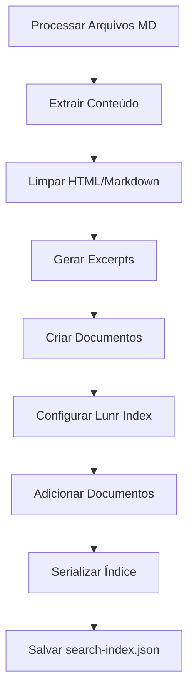
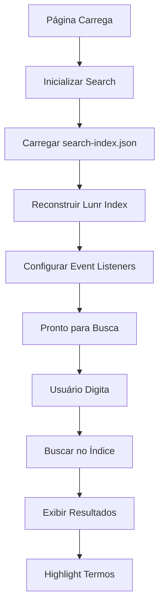

# 🔍 Sistema de Busca Full-Text - Implementação Detalhada

## 📋 Visão Geral

O Knowledge implementa um sistema de busca full-text avançado usando [Lunr.js](https://lunrjs.com/) que permite buscar em todo o conteúdo da documentação de forma rápida e eficiente, funcionando completamente offline.

## ✨ Características Principais

### 🚀 Performance
- **Busca Instantânea**: Resultados em tempo real conforme você digita
- **Índice Otimizado**: Gerado durante o build para máxima performance
- **Busca Offline**: Funciona sem conexão com a internet
- **Cache Inteligente**: Índice carregado uma vez e mantido em memória

### 🎯 Funcionalidades
- **Busca Full-Text**: Busca em títulos, conteúdo e excerpts
- **Relevância por Peso**: Títulos têm peso maior que conteúdo
- **Highlight de Termos**: Destaque visual dos termos encontrados
- **Navegação por Teclado**: Suporte completo a atalhos
- **Interface Responsiva**: Funciona em desktop e mobile
- **Busca Inteligente**: Suporte a wildcards e busca exata

### 🔧 Tecnologias
- **Lunr.js 2.3.9**: Engine de busca full-text
- **TypeScript**: Tipagem forte e melhor DX
- **CSS Moderno**: Interface elegante e acessível
- **Vanilla JavaScript**: Sem dependências de framework

## 🏗️ Arquitetura do Sistema

### Backend (Geração do Índice)

```typescript
// src/search.ts
export class SearchIndexGenerator {
    private documents: SearchDocument[] = []
    private lunrIndex: lunr.Index | null = null

    /**
     * Adiciona uma página ao índice de busca
     */
    addPage(page: DocumentPage): void {
        const cleanContent = this.cleanContent(page.content)
        const excerpt = this.generateExcerpt(cleanContent)
        
        const document: SearchDocument = {
            id: page.url,
            title: page.title,
            content: cleanContent,
            excerpt,
            url: page.url
        }
        
        this.documents.push(document)
    }

    /**
     * Constrói o índice Lunr com configuração otimizada
     */
    buildIndex(): lunr.Index {
        return lunr(function() {
            this.ref('id')
            this.field('title', { boost: 10 })    // Títulos têm peso 10x
            this.field('excerpt', { boost: 5 })   // Excerpts têm peso 5x
            this.field('content', { boost: 1 })   // Conteúdo peso normal
            
            // Configurações de stemming e stop words
            this.use(lunr.stemmer)
            this.use(lunr.stopWordFilter)
            
            documents.forEach(doc => this.add(doc))
        })
    }

    /**
     * Gera dados serializáveis para o frontend
     */
    getSerializableData(): SearchIndexData {
        return {
            documents: this.documents,
            indexData: this.lunrIndex.toJSON()
        }
    }

    /**
     * Limpa conteúdo HTML e Markdown para indexação
     */
    private cleanContent(html: string): string {
        return html
            .replace(/<[^>]*>/g, ' ')           // Remove HTML tags
            .replace(/```[\s\S]*?```/g, ' ')    // Remove code blocks
            .replace(/`[^`]*`/g, ' ')           // Remove inline code
            .replace(/\s+/g, ' ')               // Normaliza espaços
            .trim()
    }

    /**
     * Gera excerpt automático do conteúdo
     */
    private generateExcerpt(content: string, maxLength: number = 200): string {
        if (content.length <= maxLength) return content
        
        const truncated = content.substring(0, maxLength)
        const lastSpace = truncated.lastIndexOf(' ')
        
        return lastSpace > 0 
            ? truncated.substring(0, lastSpace) + '...'
            : truncated + '...'
    }
}
```

### Frontend (Interface de Busca)

```javascript
// themes/default/assets/js/search.js
class DocumentationSearch {
    constructor() {
        this.searchIndex = null
        this.documents = []
        this.isLoading = false
        this.currentQuery = ''
        this.selectedIndex = -1
        
        this.initializeElements()
        this.bindEvents()
        this.loadSearchIndex()
    }

    /**
     * Carrega o índice de busca do servidor
     */
    async loadSearchIndex() {
        if (this.isLoading) return
        
        this.isLoading = true
        this.showLoading(true)
        
        try {
            const response = await fetch('/search-index.json')
            if (!response.ok) {
                throw new Error(`HTTP ${response.status}: ${response.statusText}`)
            }
            
            const data = await response.json()
            this.documents = data.documents
            this.searchIndex = lunr.Index.load(data.indexData)
            
            console.log(`✅ Índice carregado: ${this.documents.length} documentos`)
            this.showLoading(false)
            
        } catch (error) {
            console.error('❌ Erro ao carregar índice:', error)
            this.showError(error.message)
        } finally {
            this.isLoading = false
        }
    }

    /**
     * Realiza busca no índice
     */
    performSearch(query) {
        if (!this.searchIndex || !query.trim()) {
            this.hideResults()
            return
        }

        try {
            // Preparar query para Lunr
            const processedQuery = this.processQuery(query)
            const results = this.searchIndex.search(processedQuery)
            
            this.displayResults(results, query)
            this.currentQuery = query
            
        } catch (error) {
            console.error('Erro na busca:', error)
            this.showError('Erro ao realizar busca')
        }
    }

    /**
     * Processa query para otimizar busca
     */
    processQuery(query) {
        // Busca exata com aspas
        if (query.startsWith('"') && query.endsWith('"')) {
            return query.slice(1, -1)
        }
        
        // Adiciona wildcard para busca parcial
        const terms = query.split(/\s+/).filter(term => term.length > 1)
        return terms.map(term => `${term}*`).join(' ')
    }

    /**
     * Exibe resultados da busca
     */
    displayResults(results, query) {
        if (results.length === 0) {
            this.showNoResults()
            return
        }

        const html = results.map((result, index) => {
            const doc = this.documents.find(d => d.id === result.ref)
            if (!doc) return ''

            const highlightedTitle = this.highlightText(doc.title, query)
            const highlightedExcerpt = this.highlightText(doc.excerpt, query)
            const score = (result.score * 100).toFixed(1)

            return `
                <div class="search-result-item" data-index="${index}" data-url="${doc.url}">
                    <div class="result-title">${highlightedTitle}</div>
                    <div class="result-excerpt">${highlightedExcerpt}</div>
                    <div class="result-meta">
                        <span class="result-url">${doc.url}</span>
                        <span class="result-score">Score: ${score}%</span>
                    </div>
                </div>
            `
        }).join('')

        this.resultsContainer.innerHTML = html
        this.showResults()
        this.selectedIndex = -1
    }

    /**
     * Destaca termos de busca no texto
     */
    highlightText(text, query) {
        if (!text || !query) return text

        const terms = query.toLowerCase()
            .split(/\s+/)
            .filter(term => term.length > 1)
            .map(term => term.replace(/[.*+?^${}()|[\]\\]/g, '\\$&'))

        let highlightedText = text
        terms.forEach(term => {
            const regex = new RegExp(`(${term})`, 'gi')
            highlightedText = highlightedText.replace(
                regex, 
                '<mark class="search-highlight">$1</mark>'
            )
        })

        return highlightedText
    }

    /**
     * Navegação por teclado
     */
    handleKeyNavigation(event) {
        const results = this.resultsContainer.querySelectorAll('.search-result-item')
        
        switch (event.key) {
            case 'ArrowDown':
                event.preventDefault()
                this.selectedIndex = Math.min(this.selectedIndex + 1, results.length - 1)
                this.updateSelection(results)
                break
                
            case 'ArrowUp':
                event.preventDefault()
                this.selectedIndex = Math.max(this.selectedIndex - 1, -1)
                this.updateSelection(results)
                break
                
            case 'Enter':
                event.preventDefault()
                if (this.selectedIndex >= 0 && results[this.selectedIndex]) {
                    const url = results[this.selectedIndex].dataset.url
                    window.location.href = url
                }
                break
                
            case 'Escape':
                this.hideSearch()
                break
        }
    }

    /**
     * Atualiza seleção visual
     */
    updateSelection(results) {
        results.forEach((item, index) => {
            item.classList.toggle('selected', index === this.selectedIndex)
        })
        
        // Scroll para item selecionado
        if (this.selectedIndex >= 0 && results[this.selectedIndex]) {
            results[this.selectedIndex].scrollIntoView({
                block: 'nearest',
                behavior: 'smooth'
            })
        }
    }
}
```

## 📁 Estrutura de Arquivos

```
knowledge/
├── src/
│   ├── search.ts                  # Gerador do índice de busca
│   └── generator.ts               # Integração com o gerador
├── themes/default/
│   ├── assets/
│   │   ├── js/
│   │   │   └── search.js          # Interface de busca frontend
│   │   └── css/
│   │       └── search.css         # Estilos da busca
│   └── layouts/
│       └── default.html           # Template com busca integrada
└── dist/
    └── search-index.json          # Índice gerado (build output)
```

## 🔧 Processo de Funcionamento

### 1. Geração do Índice (Build Time)

Durante o processo de build (`bun run build`):



**Exemplo de documento indexado:**
```json
{
  "id": "user-guides/user-manual.html",
  "title": "Manual do Usuário",
  "content": "texto limpo sem HTML e markdown...",
  "excerpt": "Resumo automático do conteúdo limitado a 200 caracteres...",
  "url": "user-guides/user-manual.html"
}
```

### 2. Interface de Busca (Runtime)

No frontend, quando a página carrega:



## 🎮 Interface de Usuário

### Atalhos de Teclado

| Atalho | Ação |
|--------|------|
| `Ctrl+K` / `Cmd+K` | Focar na busca |
| `Esc` | Fechar busca |
| `↑` / `↓` | Navegar pelos resultados |
| `Enter` | Abrir resultado selecionado |
| `Tab` | Navegar entre elementos |

### Sintaxe de Busca Avançada

```bash
# Busca simples
timesheet

# Múltiplos termos (AND implícito)
apex classes

# Busca exata com aspas
"Lightning Web Components"

# Busca com wildcard
time*

# Busca em campo específico
title:integration

# Busca com boost de relevância
title:integration^2
```

### Estados da Interface

1. **Estado Inicial**: Campo de busca vazio
2. **Carregando**: Indicador de loading durante carregamento do índice
3. **Buscando**: Resultados sendo filtrados em tempo real
4. **Resultados**: Lista de resultados com highlight
5. **Sem Resultados**: Mensagem quando nenhum resultado é encontrado
6. **Erro**: Mensagem de erro quando falha ao carregar índice

## 🧪 Testando a Implementação

### 1. Ambiente de Desenvolvimento

```bash
# Gerar documentação com índice
bun run build

# Iniciar servidor local
bun run serve

# Acessar: http://localhost:8080
```

### 2. Página de Teste Dedicada

Acesse: `http://localhost:8080/test-search.html`

**Casos de teste sugeridos:**
- Busca simples: `timesheet`
- Busca múltipla: `apex integration`
- Busca exata: `"Lightning Web Components"`
- Busca com wildcard: `time*`
- Busca em português: `documentação`
- Busca com caracteres especiais: `@salesforce`

### 3. Verificação do Índice

```bash
# Verificar se índice foi gerado
ls -la dist/search-index.json

# Ver estatísticas do índice
curl -s http://localhost:8080/search-index.json | jq '.documents | length'

# Ver exemplo de documento
curl -s http://localhost:8080/search-index.json | jq '.documents[0]'

# Verificar tamanho do índice
du -h dist/search-index.json
```

## 📊 Métricas e Performance

### Estatísticas Atuais
- **Documentos indexados**: Varia conforme conteúdo
- **Tamanho médio do índice**: ~1-2MB para 50-100 páginas
- **Campos indexados**: 3 (title, excerpt, content)
- **Performance de busca**: < 50ms para busca típica
- **Tempo de carregamento**: < 200ms para carregar índice

### Configuração de Pesos

```typescript
// Configuração atual de relevância
this.field('title', { boost: 10 })    // Títulos: peso máximo
this.field('excerpt', { boost: 5 })   // Excerpts: peso médio
this.field('content', { boost: 1 })   // Conteúdo: peso base
```

### Otimizações Implementadas

1. **Limpeza de Conteúdo**: Remove HTML, código e markdown
2. **Excerpts Inteligentes**: Geração automática de resumos
3. **Stemming**: Redução de palavras à raiz
4. **Stop Words**: Filtro de palavras irrelevantes
5. **Wildcard Automático**: Busca parcial por padrão

## 🎨 Personalização

### Modificar Pesos de Busca

```typescript
// src/search.ts - método buildIndex()
this.field('title', { boost: 15 })    // Aumentar peso do título
this.field('excerpt', { boost: 3 })   // Diminuir peso do excerpt
this.field('content', { boost: 1 })   // Manter peso do conteúdo
```

### Customizar Interface

```css
/* themes/default/assets/css/search.css */

/* Overlay da busca */
.search-overlay {
    background: rgba(0, 0, 0, 0.8);
    backdrop-filter: blur(4px);
}

/* Container de resultados */
.search-results {
    max-height: 60vh;
    overflow-y: auto;
}

/* Item de resultado */
.search-result-item {
    padding: 1rem;
    border-bottom: 1px solid #eee;
    cursor: pointer;
    transition: background-color 0.2s;
}

.search-result-item:hover,
.search-result-item.selected {
    background-color: #f8f9fa;
}

/* Highlight de termos */
.search-highlight {
    background: #ffeb3b;
    color: #333;
    padding: 0 2px;
    border-radius: 2px;
}
```

### Adicionar Filtros Personalizados

```javascript
// themes/default/assets/js/search.js
performSearch(query) {
    let results = this.searchIndex.search(query)
    
    // Filtrar por categoria
    if (this.selectedCategory) {
        results = results.filter(result => {
            const doc = this.documents.find(d => d.id === result.ref)
            return doc && doc.category === this.selectedCategory
        })
    }
    
    // Filtrar por data
    if (this.dateFilter) {
        results = results.filter(result => {
            const doc = this.documents.find(d => d.id === result.ref)
            return doc && new Date(doc.date) >= this.dateFilter
        })
    }
    
    this.displayResults(results, query)
}
```

## 🔮 Roadmap e Melhorias Futuras

### Funcionalidades Planejadas

1. **Filtros Avançados**
   - Filtro por categoria/seção
   - Filtro por data de modificação
   - Filtro por tipo de conteúdo

2. **Busca Facetada**
   - Sidebar com filtros
   - Contadores de resultados por categoria
   - Filtros múltiplos combinados

3. **Sugestões Inteligentes**
   - Autocomplete baseado no índice
   - Correção automática de termos
   - Sugestões de busca relacionada

4. **Analytics de Busca**
   - Tracking de termos mais buscados
   - Métricas de performance
   - Relatórios de uso

5. **Busca Semântica**
   - Integração com embeddings
   - Busca por similaridade
   - Recomendações de conteúdo

### Extensões Experimentais

1. **Busca por Voz**
   ```javascript
   // Web Speech API integration
   const recognition = new webkitSpeechRecognition()
   recognition.onresult = (event) => {
       const query = event.results[0][0].transcript
       this.performSearch(query)
   }
   ```

2. **Busca Visual**
   - Screenshots de componentes UI
   - Busca por imagens
   - OCR em diagramas

3. **AI-Powered Search**
   - Integração com LLMs
   - Busca em linguagem natural
   - Respostas contextuais

4. **Busca Federada**
   - Múltiplas fontes de dados
   - APIs externas
   - Agregação de resultados

## 🐛 Troubleshooting

### Problemas Comuns

#### 1. Índice não carrega
```bash
# Verificar se arquivo existe
curl -I http://localhost:8080/search-index.json

# Verificar permissões
ls -la dist/search-index.json

# Verificar console do navegador
# F12 > Console > Procurar erros
```

#### 2. Busca não funciona
```javascript
// Verificar se Lunr.js carregou
console.log(typeof lunr) // deve ser 'function'

// Verificar se índice foi carregado
console.log(window.searchInstance?.searchIndex) // deve ser objeto

// Verificar documentos
console.log(window.searchInstance?.documents?.length) // deve ser > 0
```

#### 3. Resultados incorretos
```javascript
// Testar query diretamente
const results = searchIndex.search('seu termo')
console.log(results)

// Verificar configuração de pesos
console.log(searchIndex.fields)

// Verificar limpeza de conteúdo
console.log(documents[0].content) // deve estar limpo
```

#### 4. Performance lenta
```javascript
// Medir tempo de busca
console.time('search')
const results = searchIndex.search('termo')
console.timeEnd('search')

// Verificar tamanho do índice
console.log(JSON.stringify(searchIndex).length)

// Verificar número de documentos
console.log(documents.length)
```

### Logs de Debug

```javascript
// Habilitar logs detalhados
window.DEBUG_SEARCH = true

// Logs automáticos serão exibidos no console
// - Carregamento do índice
// - Tempo de busca
// - Número de resultados
// - Erros de parsing
```

### Ferramentas de Análise

```bash
# Analisar índice gerado
node -e "
const fs = require('fs')
const data = JSON.parse(fs.readFileSync('dist/search-index.json'))
console.log('Documentos:', data.documents.length)
console.log('Tamanho do índice:', JSON.stringify(data.indexData).length)
console.log('Campos:', Object.keys(data.indexData.fields))
"

# Verificar duplicatas
jq '.documents | group_by(.id) | map(select(length > 1))' dist/search-index.json

# Estatísticas de conteúdo
jq '.documents | map(.content | length) | add / length' dist/search-index.json
```

---

O sistema de busca do Knowledge foi projetado para ser **rápido**, **intuitivo** e **extensível**, proporcionando uma experiência de busca moderna e eficiente para toda a documentação. 